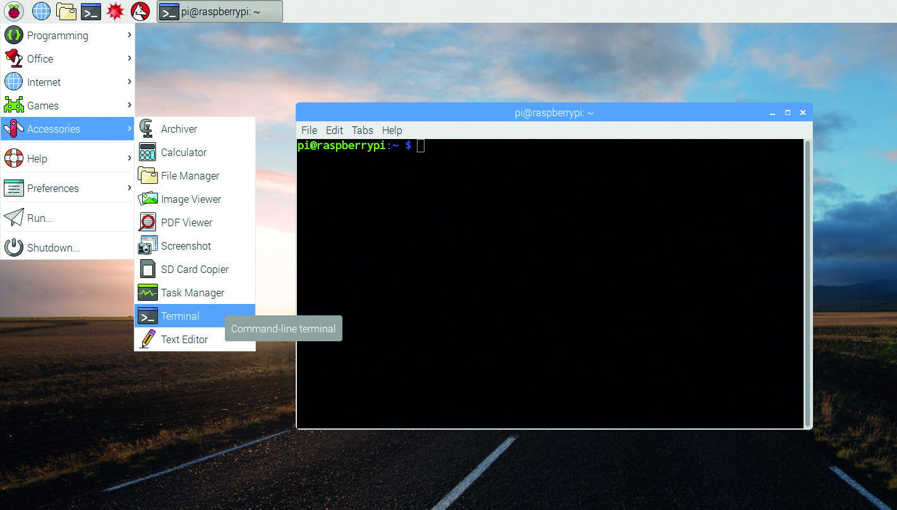
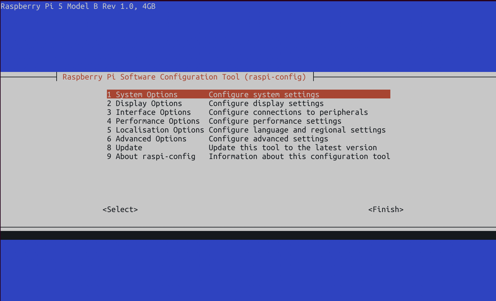
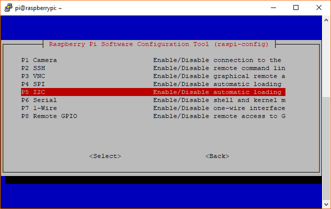

# GEN-4-ESS-BMO-Lab
Code base for GUI and Spectrometer control for ESS system BMO Lab Boston University

# Get Started
First, follow this [guide](https://docs.google.com/document/d/1FLaeKsOsEHwRYacJV5ZzHZxENfK67Uf_gcZY0pdiOOk/edit?tab=t.0#heading=h.jh40iydazfo4)

## Post Flashing Instructions
Now, turn on the Raspberry Pi until it reaches the desktop screen. Now we have to enable the Serial Interface and the I2C bus. 

To do this, right click the desktop and click Open New Terminal:

Then run:
```sh
sudo raspi-config
```
This window should open up:


Navigate to `3. Interface Options`:
and go to `P5. I2C`, and enable that. Then the next option you want to enable from the same `3. Interface Options` is `P6. Serial`. You don't want to enable the remote shell, just the serial interface. Picture shown below.

 


